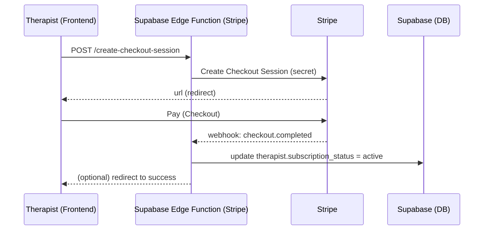
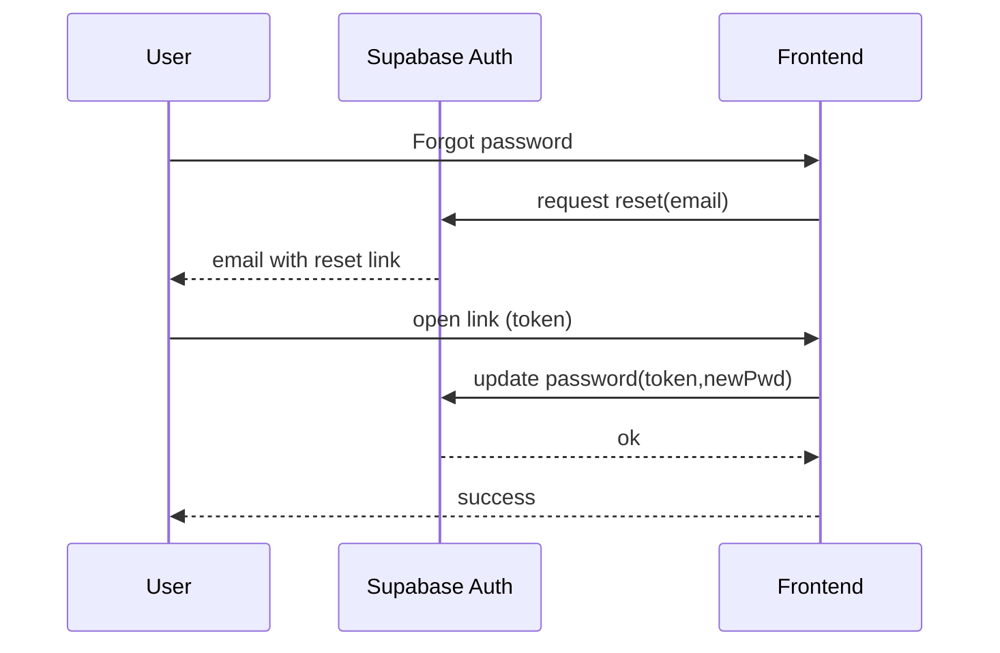
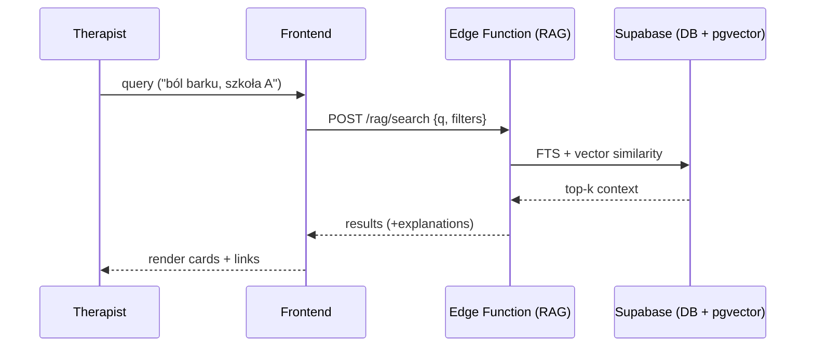

# Architecture — Marmaid

## 1. System Overview / Context
**Marmaid** to aplikacja webowa dla terapeutów punktów marma. Architektura jest lekka (frontend statyczny + BaaS) z możliwością rozbudowy. Główne komponenty:

- **Frontend (React, GitHub Pages)** – UI terapeuty, formularz intake, wizualizacja punktów marma (2D/3D).  
- **Backend / Data** – **Supabase** (Postgres + Auth + Realtime + Edge Functions).  
- **Płatności** – **Stripe** (Checkout + Webhooks) obsługiwane przez Supabase Edge Functions.  
- **Wizualizacja punktów** – moduł 2D (SVG) i/lub 3D (Three.js) z danymi anatomicznymi i mapą punktów.  
- **Knowledge Base / RAG** – baza wiedzy o punktach marma (Postgres + pgvector) + wektorowy indeks wskazań/przeciwwskazań + pipeline embeddingów.  

Komunikacja: frontend łączy się bezpośrednio z Supabase (SDK) dla Auth/DB oraz wywołuje **Edge Functions** dla operacji wymagających sekretów (Stripe, RAG-inference, importy danych).

---

## 2. Dobór technologii i bibliotek (MVP)

| Obszar | Wybór | Uzasadnienie |
|---|---|---|
| Budowanie frontu | **Vite + React 18** | Szybkie dev/build, ekosystem React |
| UI | **TailwindCSS** + **shadcn/ui** | Szybkie, spójne komponenty i styl |
| Routing | **React Router** | Standard SPA |
| Data fetching | **TanStack Query** | Cache, synchronizacja z Supabase |
| Stan UI | **Zustand** (lekki) | Lokalny stan bez Redux |
| Formularze | **React Hook Form** + **Zod** | Walidacja, DX |
| Auth & DB | **@supabase/supabase-js** + **@supabase/auth-ui-react** (opcjonalnie) | Rejestracja, logowanie, reset hasła, operacje DB |
| Wizualizacja 3D | **three.js** + **react-three-fiber** + **drei** | Sceny 3D, łatwa integracja z React |
| Wizualizacja 2D | **SVG** + **react-svg-pan-zoom** | Pan/zoom, adnotacje punktów |
| Płatności | **@stripe/stripe-js** (frontend) + **Stripe SDK (Edge Function)** | Checkout i webhooks |
| E-mail | **Supabase Auth emails** / (opcjonalnie) **Resend/Mailgun** przez Edge Function | Reset hasła, powiadomienia |
| RAG / Embeddings | **pgvector** (Supabase) + **OpenAI/Cohere/Voyage** (pluggable) | Wektoryzacja treści i podobieństwo |

---

## 3. Frontend Architecture
**Struktura:**
```
src/
  app/               # routing, layout
  components/        # UI współdzielone (shadcn/ui)
  features/
    auth/            # logowanie, rejestracja, reset
    clients/         # listy, profil klienta, intake preview
    sessions/        # logowanie sesji, notatki, "what worked / next"
    planning/        # wybór szkoły, lista punktów, plan terapii
    viz3d/           # canvasy 3D, overlay punktów
    billing/         # Stripe checkout, status subskrypcji
    search/          # KB/RAG UI (wyszukiwarka punktów/objawów)
  lib/               # supabase client, helpers, auth guards
  styles/            # tailwind.css
```

**Wzorce:**
- **Protected routes** (guardy auth) – dostęp do danych tylko po zalogowaniu.  
- **React Query** do synchronizacji z Supabase (useQuery/useMutation).  
- **Formularze** RHF+Zod (schematy walidacji współdzielone z backendem tam gdzie możliwe).  
- **Wizualizacja**:  
  - 2D: SVG + warstwa adnotacji (nazwy, ID punktów, tooltipy).  
  - 3D: react-three-fiber (GLTF/FBX model sylwetki), overlay punktów (XYZ, label, kolory wg szkoły).  

---

## 4. Backend & Database (Supabase)
### 4.1 Model danych (propozycja MVP)
- **users** (id, email, role: `therapist`|`client`, stripe_customer_id, created_at)
- **therapists** (id -> users.id, profile, subscription_status)
- **clients** (id, therapist_id, name, contact, intake_id?)
- **intakes** (id, client_id, payload_json, created_at)
- **sessions** (id, client_id, date, notes, effectiveness_rating, next_try_json)
- **schools** (id, name, description)
- **points** (id, school_id, code, name, location_text, contraindications, indications, synonyms)
- **point_geometry** (point_id, type: `2d`|`3d`, coords, model_ref)
- **session_points** (session_id, point_id, technique, result_note)
- **kb_articles** (id, title, body_md, tags[])
- **kb_embeddings** (kb_id, embedding vector) — **pgvector**

> Uwaga: dane PII pacjentów ograniczamy do minimum. Dane zdrowotne w MVP nie wymagają certyfikacji, ale należy uwzględnić RODO.

### 4.2 API
- Dostęp przez **PostgREST** (Supabase) – CRUD na tabelach z politykami RLS.  
- **Edge Functions** dla: Stripe (checkout, webhooks), importy KB, generowanie/odświeżanie embeddingów, ewentualny endpoint RAG.

### 4.3 RLS (Row-Level Security)
- **therapist**: pełny dostęp tylko do własnych rekordów (clients, sessions, intakes, session_points).  
- **client**: dostęp tylko do *własnego* intake i ewentualnego portalu (read-only).  
- **public**: brak dostępu do danych wrażliwych.  
- Polityki RLS muszą wiązać rekordy z `auth.uid()`.

---

## 5. Authentication & Security
- **Rejestracja / Logowanie**: Supabase Email/Password (opcjonalnie magic link/OAuth w przyszłości).  
- **Reset hasła**: wbudowany flow Supabase (e-mail + update hasła po tokenie), ekran w aplikacji do ustawienia nowego hasła.  
- **Role**: `therapist`, `client` (na przyszłość), `admin` (wewnętrzne).  
- **RLS + Policies**: rozdzielenie danych terapeuty i klienta; twarde ograniczenia zapytań.  
- **Szyfrowanie**: TLS w tranzycie (Supabase), rozważ **field-level encryption** dla szczególnie wrażliwych notatek.  
- **Region danych (RODO/GDPR)**: preferuj region UE w Supabase; polityka retencji i eksportu danych.

---

## 6. Payments — Stripe (subskrypcje terapeuty)
**Dlaczego Edge Functions?** Frontend (GitHub Pages) nie może trzymać sekretów Stripe. Logika płatności idzie przez **Supabase Edge Functions** (Deno):

**Flow (Mermaid):**


**Elementy:**
- **Create Checkout** (EF): tworzy sesję, zapisuje `stripe_customer_id`.  
- **Webhook** (EF): aktualizuje status subskrypcji, obsługuje odnowienia/anulacje.  
- **Guard w UI**: feature gating (np. dostęp do KB/RAG tylko dla aktywnej subskrypcji).

---

## 7. Intake — szybki rollout
Zgodnie z PRD: **szybsza ścieżka** przez zewnętrzny formularz (np. Google Forms/Typeform) na start. Integracja:
- Formularz → **Webhook** → **Edge Function** → zapis do `intakes` + powiązanie z `clients`.  
- Później: przeniesienie do natywnego formularza w aplikacji.

---

## 8. Wizualizacja punktów marma (2D/3D)
**2D (MVP-friendly):**
- SVG sylwetki (przód/tył/boki) + warstwa punktów (x,y w %).  
- Zoom/pan, wskazanie punktu, opis, kolor wg szkoły, grupowanie.

**3D (docelowo / opcja MVP+):**
- Model ciała (GLTF) w react-three-fiber.  
- Mapa punktów: współrzędne (x,y,z), snapping do powierzchni modelu, selekcja + tooltip.  
- Tryb „porównaj szkoły”: przełączanie zestawów punktów, heatmapa „co już było stosowane”.

**Źródła danych:** własny dataset (licencjonowane źródła/opracowanie). Uwaga na prawa autorskie i zgodność merytoryczną.

---

## 9. Knowledge Base / RAG / Wyszukiwanie
**Cel:** odpowiedź na pytania typu: _„ból X → które punkty i techniki wg danej szkoły?”_

**Warstwy:**
1. **KB (strukturalna)** – tabele: `points`, `schools`, `indications`, `contraindications`, relacje N:M (np. `point_indication`).  
2. **Full‑Text Search** – Postgres FTS (tsvector) po polach opisowych.  
3. **Vector Search (pgvector)** – embeddingi opisów punktów, wskazań, artykułów.  
4. **RAG Service (EF)** – funkcja Edge wykonuje: query → podobieństwo (pgvector) → pobranie kontekstu (DB) → _opcjonalnie_ wygenerowanie odpowiedzi (LLM) → zwrot do frontu.

**Pipeline embeddingów:**
- **Ingest**: dodanie/aktualizacja artykułu/punktu → EF tworzy embedding (OpenAI/Cohere/Voyage – konfigurowalne) → zapis do `kb_embeddings`.  
- **Czyszczenie danych**: brak PII; KB to wiedza fachowa, nie dane pacjentów.  

**UI wyszukiwarki:**  
- Pole wyszukiwania (słowa kluczowe + filtry: szkoła, obszar ciała).  
- Karta punktu: opis, wskazania, przeciwwskazania, wizualizacja (2D/3D), odnośniki.

---

## 10. Deployment & Hosting
- **Frontend**: GitHub Pages (CI: build Vite → deploy).  
- **Supabase**: projekt w regionie UE, **Edge Functions** deployowane przez CLI, **Database Migrations** przez `supabase db`/SQL.  
- **Stripe**: klucze w **Edge Function secrets**, webhook endpoint publiczny (Supabase).  
- **Monitoring**: Supabase logs (DB/Functions), Stripe dashboard, Sentry (frontend).  

---

## 11. Non‑Functional
- **Wydajność**: LCP < 2.5s (SPA), lazy‑loading scen 3D.  
- **Skalowalność**: start na Free Tier; ścieżka do Pro (stały uptime, więcej storage).  
- **Niezawodność**: >95% (zależne od usług).  
- **Bezpieczeństwo**: RLS, minimalizacja zakresu danych, regularne przeglądy polityk.  
- **Backup/Export**: eksport danych klienta na żądanie (RODO), cykliczne backupy DB (na Pro).  

---

## 12. Otwarte decyzje / Ryzyka
- **Legal/licensing** dla datasetu punktów i sylwetek 3D/SVG.  
- **Precyzja odwzorowania** punktów (różnice między szkołami) – potrzebny panel redakcyjny i wersjonowanie.  
- **RAG**: koszt embeddingów / inferencji vs. wartość w MVP – zacząć od FTS + prostych filtrów, RAG jako „MVP+”.  
- **Płatności**: model cenowy (miesięczny/roczny), ograniczenia planu (feature gating).  

---

## 13. Roadmapa techniczna (skrót)
1. **MVP**: Auth, klienci, sesje, szkoły/punkty (2D), intake (zewn. formularz + webhook), Stripe Checkout, podstawowe RLS.  
2. **MVP+**: natywny intake, wersje szkół/punktów, podstawowe FTS wyszukiwarki, eksport danych.  
3. **RAG Beta**: pgvector + embeddingi KB, prosty interfejs zapytań.  
4. **3D**: model GLTF, overlay punktów, tryb porównawczy szkół.  
5. **Portal klienta**: rola `client`, dostęp tylko do własnych danych i zaleceń.  

---

### Załącznik A — Sekwencje kluczowych flow (Mermaid)

**Reset hasła (Supabase):**


**Zapytanie RAG (wyszukiwarka punktów):**


---

### Notatki dot. dostępu klienta (Twoje pyt. Q3)
- Wymaga **roli** `client`, osobnego logowania i rygorystycznego RLS (dostęp wyłącznie do własnych danych).  
- UI „portal klienta” z widokiem: profil, intake, przegląd zaleceń/planów (read‑only w MVP).  
- Zgody/RODO: checkboxy na udostępnienie danych, możliwość wycofania zgody, prawo do eksportu/usunięcia danych.  
- E‑maile transakcyjne (zaproszenie do portalu) przez Edge Function.

