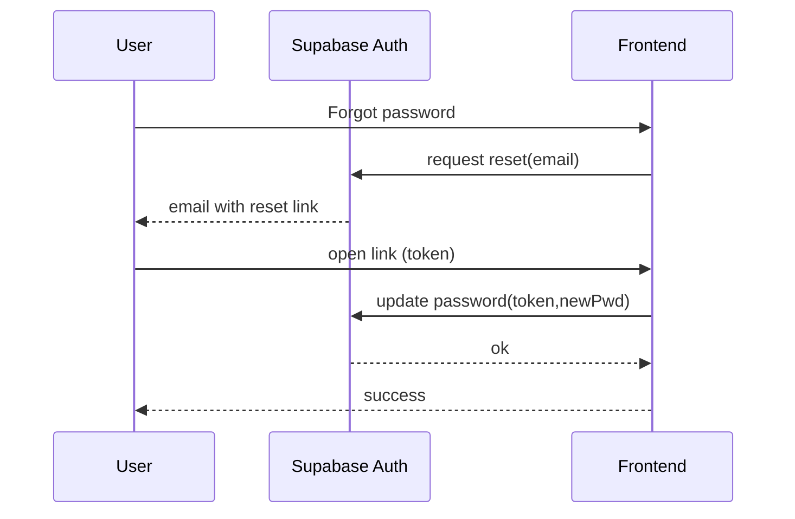
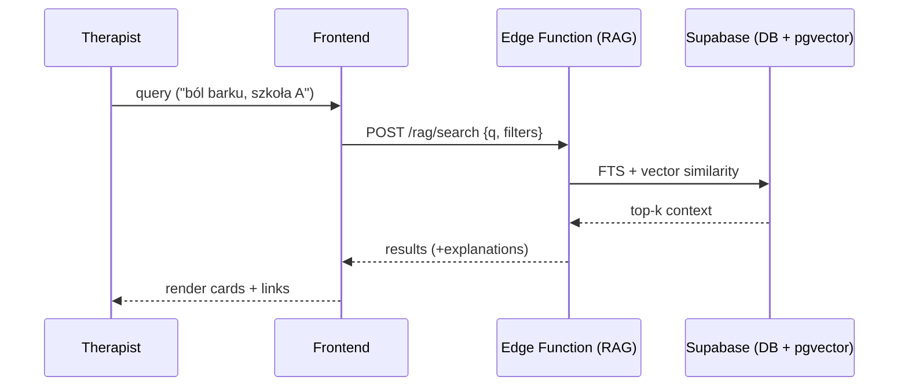

# 13. Roadmapa techniczna (skrót)
1. **MVP**: Auth, klienci, sesje, szkoły/punkty (2D), intake (zewn. formularz + webhook), Stripe Checkout, podstawowe RLS.  
2. **MVP+**: natywny intake, wersje szkół/punktów, podstawowe FTS wyszukiwarki, eksport danych.  
3. **RAG Beta**: pgvector + embeddingi KB, prosty interfejs zapytań.  
4. **3D**: model GLTF, overlay punktów, tryb porównawczy szkół.  
5. **Portal klienta**: rola `client`, dostęp tylko do własnych danych i zaleceń.  

---

## Załącznik A — Sekwencje kluczowych flow (Mermaid)

**Reset hasła (Supabase):**

**Zapytanie RAG (wyszukiwarka punktów):**

---

## Notatki dot. dostępu klienta (Twoje pyt. Q3)
- Wymaga **roli** `client`, osobnego logowania i rygorystycznego RLS (dostęp wyłącznie do własnych danych).  
- UI „portal klienta” z widokiem: profil, intake, przegląd zaleceń/planów (read‑only w MVP).  
- Zgody/RODO: checkboxy na udostępnienie danych, możliwość wycofania zgody, prawo do eksportu/usunięcia danych.  
- E‑maile transakcyjne (zaproszenie do portalu) przez Edge Function.

