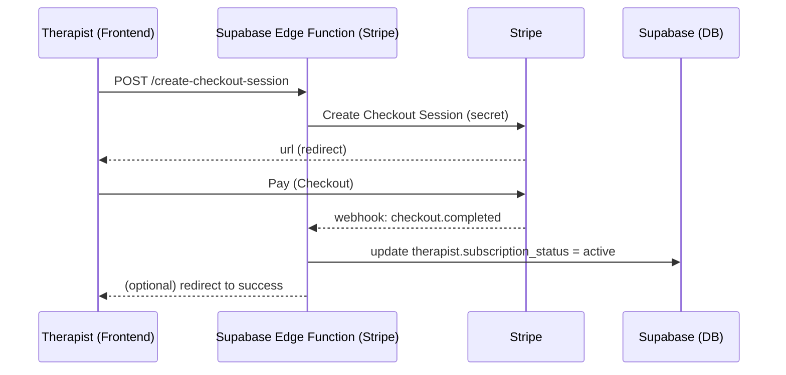

# 6. Payments — Stripe (subskrypcje terapeuty)
**Dlaczego Edge Functions?** Frontend (GitHub Pages) nie może trzymać sekretów Stripe. Logika płatności idzie przez **Supabase Edge Functions** (Deno):

**Flow (Mermaid):**

**Elementy:**
- **Create Checkout** (EF): tworzy sesję, zapisuje `stripe_customer_id`.  
- **Webhook** (EF): aktualizuje status subskrypcji, obsługuje odnowienia/anulacje.  
- **Guard w UI**: feature gating (np. dostęp do KB/RAG tylko dla aktywnej subskrypcji).

---
