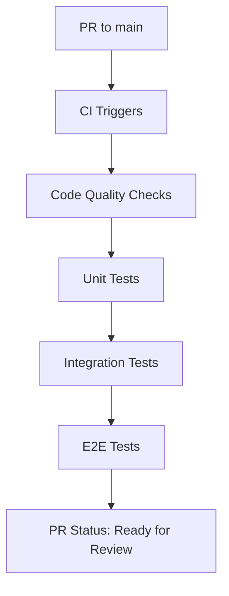
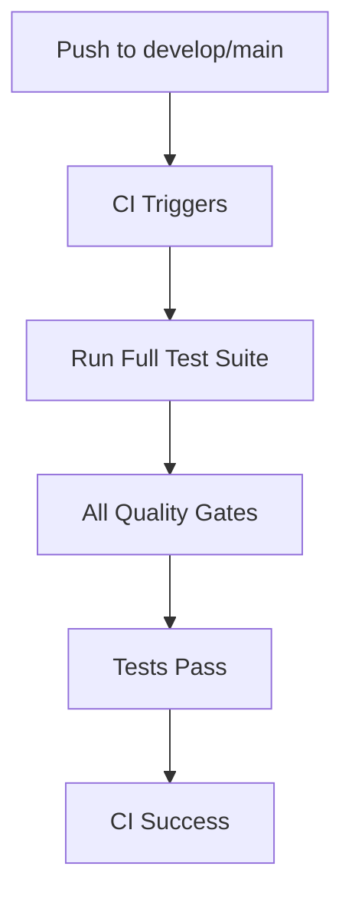
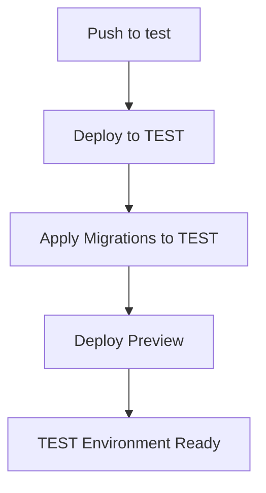
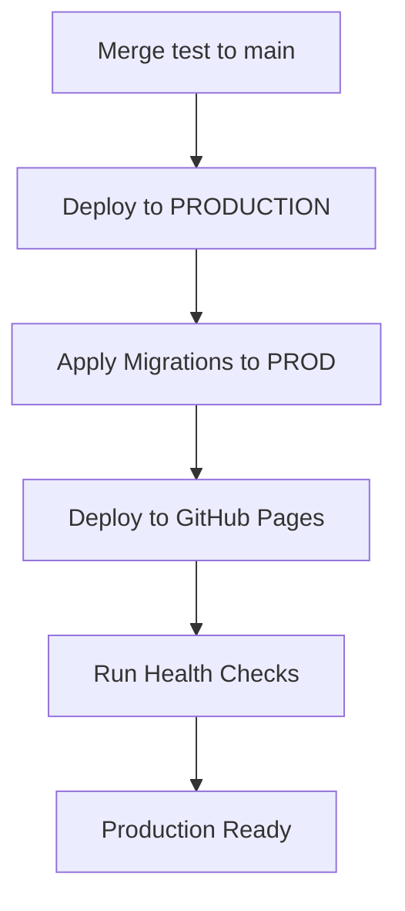

# Developer Workflow - Fully Automated

## 🎯 Philosophy: Developer Codes, CI/CD Handles Everything Else

### Developer Responsibilities (Minimal)

- ✅ Write code and tests
- ✅ Create meaningful commits
- ✅ Create Pull Requests
- ❌ Manual migrations
- ❌ Manual testing on remote environments
- ❌ Manual deployments

## 🚀 Step-by-Step Developer Process

### 1. Initial Setup (One Time)

```bash
# Clone and setup
git clone repo && cd marmaid
npm run setup  # Installs all deps + sets up environments
```

The `npm run setup` script automatically:

- Installs frontend dependencies
- Sets up Supabase local (Docker)
- Applies all migrations to local DB
- Seeds test data
- Configures pre-commit hooks
- Creates `.env.local` for development

### 2. Daily Development Cycle

#### Start Development

```bash
npm run dev  # Starts both Supabase local + frontend
```

#### Write Code + Tests

```javascript
// Developer writes features with tests
// Pre-commit hooks ensure quality before commit
```

#### Commit Changes

```bash
git add .
git commit -m "feat: add client profile creation"
```

Pre-commit hook automatically runs:

- ESLint + TypeScript checks
- Unit tests
- Test coverage verification
- Code formatting

#### Push and Create PR

```bash
git push origin feature-branch
# Create PR on GitHub
```

### 3. What Happens Automatically

#### On Pull Request to main:



#### On Push to develop/main branches:



#### On Push to test branch:



#### On Merge test to main (Production):



## 🔧 Automation Scripts

### Local Development Setup

```json
{
  "scripts": {
    "setup": "scripts/setup-development.sh",
    "dev": "scripts/start-development.sh",
    "dev:reset": "scripts/reset-local-db.sh",
    "test:local": "scripts/run-local-tests.sh"
  }
}
```

### CI/CD Automation Points

#### Database Migrations

```yaml
# Auto-applied in workflows, never manual
- Local Development: npm run setup applies all migrations
- Push to test branch: Apply migrations to TEST database
- Merge test to main: Apply migrations to PRODUCTION
```

#### Testing Strategy

```yaml
Local Development:
  - Unit tests (fast feedback)
  - Linting and type checking

Pull Request to main:
  - All unit tests
  - Integration tests (if Supabase credentials available)
  - E2E tests (critical paths)
  - Quality gates (linting, typecheck, coverage)

Push to test branch:
  - Deploy to TEST environment
  - Apply migrations to TEST database

Production Deployment:
  - Smoke tests
  - Health checks
  - Rollback capability
```

#### Deployment Pipeline

```yaml
Automatic Deployments:
  - Push to test branch → Deploy to TEST (marmaid-test repo)
  - Merge test to main → Deploy to PRODUCTION (marmaid repo)
  - All deployments use GitHub Pages
```

## 🎮 Developer Experience

### What Developer Sees:

```bash
# Morning routine:
npm run dev           # Everything starts automatically

# During development:
git commit -m "..."   # Pre-commit ensures quality

# End of feature:
git push              # CI handles everything else
```

### What Developer Gets:

- ✅ **Instant feedback**: Pre-commit hooks catch issues early
- ✅ **Zero config**: Everything works out of the box
- ✅ **Real-time testing**: Integration tests run against real TEST DB
- ✅ **Deploy previews**: Every PR gets a live preview link
- ✅ **Automatic rollbacks**: Failed deployments auto-rollback
- ✅ **Status visibility**: Clear GitHub status checks

## 🚨 When Developer Intervention Required

### Rare Cases Requiring Manual Action:

1. **Breaking schema changes**: Need to coordinate with team
2. **Production hotfixes**: May bypass normal flow with approval
3. **Rollback decisions**: Team decides if rollback needed
4. **Environment issues**: If CI/CD environments are down

### Emergency Procedures:

```bash
# Emergency production fix
npm run emergency:hotfix  # Creates emergency branch + fast-track CI

# Manual rollback (if automatic fails)
npm run rollback:prod     # Rolls back last deployment
```

## 📊 Success Metrics

### Developer Productivity:

- ⏱️ **Setup time**: < 5 minutes from clone to coding
- 🚀 **Deploy time**: < 10 minutes from PR merge to production
- 🔄 **Feedback loop**: < 30 seconds for local changes
- ✅ **Success rate**: > 95% successful automated deployments

### Quality Assurance:

- 🛡️ **No breaking changes**: Pre-commit hooks prevent bad commits
- 🧪 **Test coverage**: Maintained automatically through CI
- 🔒 **Security**: Automated vulnerability scanning
- 📈 **Performance**: Automatic performance regression detection
