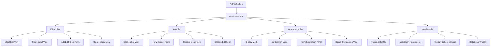
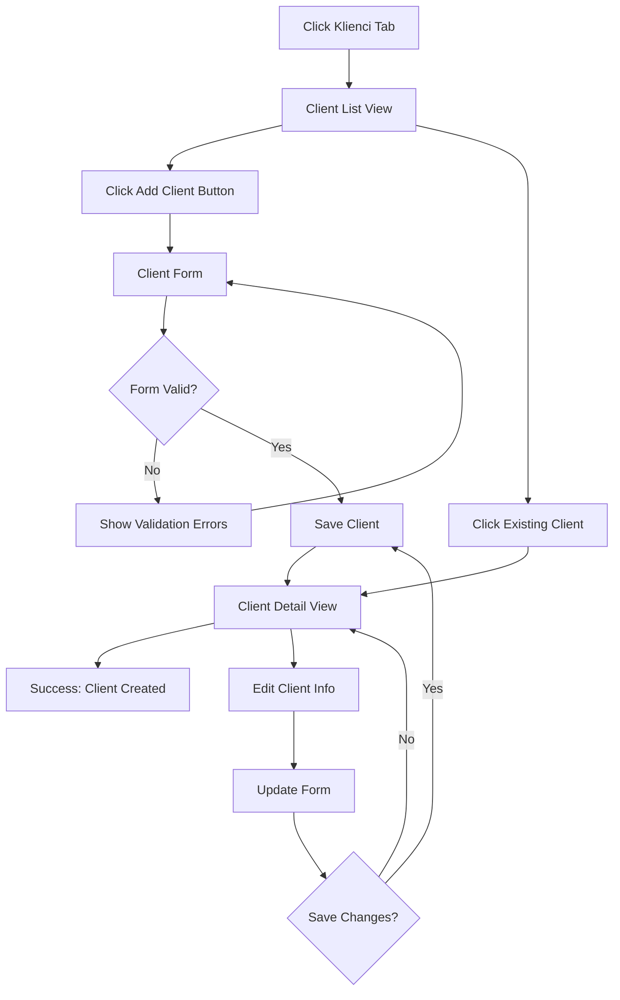
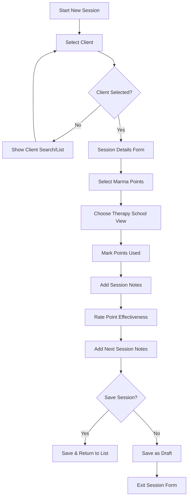
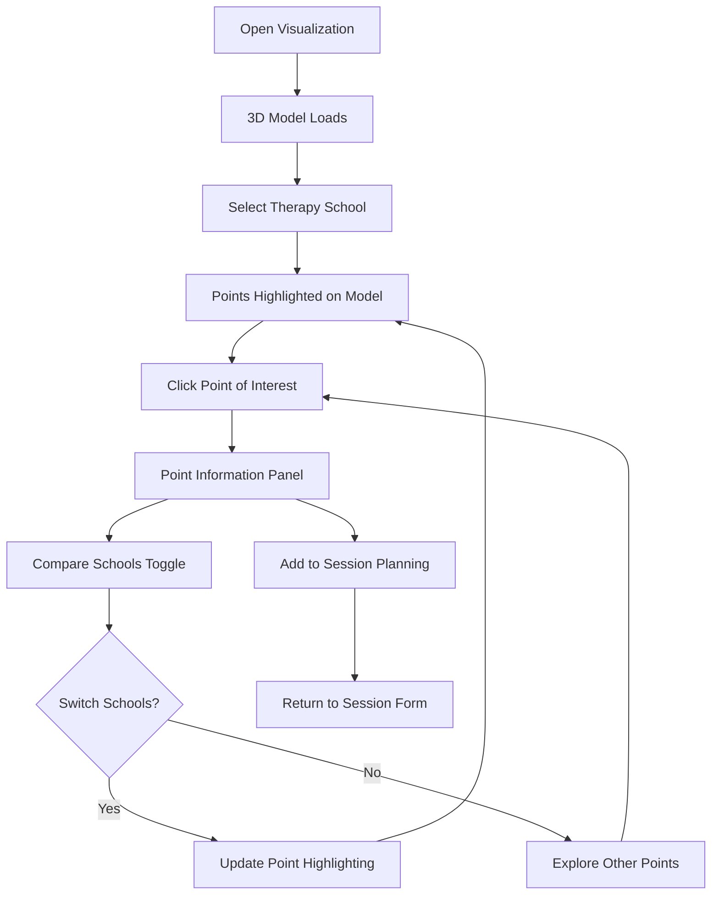

# Marmaid UI/UX Specification

## Introduction

This document defines the user experience goals, information architecture, user flows, and visual design specifications for Marmaid's user interface transformation. It serves as the foundation for visual design and frontend development, ensuring a cohesive and user-centered therapeutic application experience.

### Overall UX Goals & Principles

#### Target User Personas

**Primary Persona: Professional Marma Therapist**
- Uses application daily for client management and session planning
- Needs quick access to client history and therapy point references
- Values professional, calming interface that reflects therapeutic practice
- Comfortable with technology but prioritizes efficiency over complex features
- Switches between clients frequently during busy practice days

**Secondary Persona: Therapy Student/New Practitioner** 
- Learning marma point locations and therapy techniques
- Relies heavily on 3D visualization for educational purposes
- Needs clear guidance and extensive reference information
- Uses application less frequently but for longer educational sessions

#### Usability Goals

- **Immediate Access**: Therapists can navigate to any client or session information within 2 clicks from dashboard
- **Visual Learning**: New practitioners can identify marma points and their variations across therapy schools using interactive 3D models
- **Efficient Workflow**: Experienced therapists can document a complete session (client selection, points used, notes) in under 3 minutes
- **Professional Confidence**: Interface conveys therapeutic professionalism, increasing therapist confidence when sharing screen with clients
- **Error Prevention**: Clear validation prevents accidental data loss during session documentation

#### Design Principles

1. **Therapeutic Calm over Technical Complexity** - Use wellness-focused colors and spacing that create a calming environment conducive to therapeutic practice
2. **Quick Access to Essential Information** - Client history, point references, and session notes should be immediately visible without excessive navigation
3. **Visual Learning Support** - 3D visualization and clear point identification take priority over text-heavy interfaces
4. **Professional Medical Aesthetic** - Balance approachable wellness design with professional credibility expected in therapeutic settings  
5. **Graceful Progressive Disclosure** - Advanced features available but don't overwhelm daily workflow essentials

### Change Log

| Date | Version | Description | Author |
|------|---------|-------------|---------|
| 2024-12-29 | 1.0 | Initial UI/UX specification for dashboard transformation | BMad Master |

---

## Information Architecture (IA)

### Site Map / Screen Inventory

### Navigation Structure

**Primary Navigation:** Horizontal tab bar below main header containing four equal-width tabs: "Klienci", "Sesje", "Wizualizacja", "Ustawienia". Active tab indicated by wellness green accent color and subtle shadow elevation.

**Secondary Navigation:** Within-tab navigation varies by section:
- Klienci: List/Grid toggle, Add Client button, Search/Filter bar
- Sesje: New Session button, Date range picker, Client filter dropdown
- Wizualizacja: 3D/2D toggle, School selector, Point category filters
- Ustawienia: Left sidebar with settings categories

**Breadcrumb Strategy:** Not used due to shallow 2-level navigation structure. Current location clearly indicated by active tab and page titles within tabs.

---

## User Flows

### Client Management Flow

**User Goal:** Add a new client and access their information for session planning

**Entry Points:** 
- Dashboard "Klienci" tab → "Add Client" button
- Session creation form → "New Client" link

**Success Criteria:** Client profile created with complete intake information, accessible for future session planning

#### Flow Diagram

#### Edge Cases & Error Handling:
- Duplicate client names → Show warning with option to proceed or edit
- Network error during save → Local storage backup with retry option
- Incomplete required fields → Inline validation with clear error messages
- Large client list performance → Virtual scrolling with search functionality

**Notes:** Integration with session planning allows quick client selection without leaving session creation workflow.

### Session Planning & Documentation Flow

**User Goal:** Plan and document a therapy session including marma points used and session notes

**Entry Points:**
- Dashboard "Sesje" tab → "New Session" button  
- Client detail view → "Add Session" button
- Quick session entry from any tab via floating action button

**Success Criteria:** Session documented with client, date, marma points used, effectiveness notes, and next session planning notes

#### Flow Diagram

#### Edge Cases & Error Handling:
- Session in progress interrupted → Auto-save draft every 30 seconds
- Marma point not found in current school → Suggest alternative or add custom point
- Time conflict with existing session → Show warning with reschedule option
- Missing required session notes → Soft validation with option to save incomplete

**Notes:** Seamless integration with visualization tab allows therapists to reference 3D models during session planning without losing form data.

### 3D Visualization Exploration Flow

**User Goal:** Explore marma point locations and compare definitions across therapy schools

**Entry Points:**
- Dashboard "Wizualizacja" tab
- Session planning → "View Point Location" button
- Client history → "Review Points Used" link

**Success Criteria:** Clear understanding of marma point location, purpose, and variations between therapy schools

#### Flow Diagram

#### Edge Cases & Error Handling:
- 3D model loading failure → Fallback to 2D diagram with full functionality
- Slow device performance → Automatic quality reduction with user override option
- Point information missing → Show basic location with link to external resources
- School comparison conflicts → Clear visual indicators of differences

**Notes:** Performance optimization ensures smooth experience on standard laptops. Lazy loading prevents initial page load delays.

---

## Wireframes & Mockups

### Key Screen Layouts

#### Dashboard with Tabbed Navigation

**Purpose:** Replace current card-based layout with efficient tabbed interface for quick access to all application areas

**Key Elements:**
- Preserved header with "Marmaid Dashboard" title, user email, logout button
- Horizontal tab bar with four equal-width tabs using wellness color scheme
- Tab content area with contextual actions (Add Client, New Session, etc.)
- Quick stats or recent activity summary below tabs for dashboard overview

**Interaction Notes:** Tabs update URL for direct linking. Active tab state clearly indicated with color and elevation. Smooth transitions between tab content.

#### Client Management Interface

**Purpose:** Comprehensive client management with efficient search, detailed profiles, and integrated session history

**Key Elements:**
- Client list with search bar, filters (active/inactive, last session date)
- Grid/list view toggle for different information density preferences
- Client cards showing name, last session, next appointment, status indicators
- "Add Client" prominent action button in top-right corner
- Quick actions menu on client cards (view, edit, new session, archive)

**Interaction Notes:** Click client card opens detail view. Hover shows quick preview. Search is live-filtered. Bulk actions available for practice management.

#### Session Planning Interface

**Purpose:** Streamlined session creation and documentation with integrated marma point selection

**Key Elements:**
- Client selection dropdown with search and recent clients quick-pick
- Date/time picker with calendar view and time slot suggestions
- Marma point selection area with therapy school toggle
- Visual point selector (miniature body diagram) with click-to-add
- Session notes area with structured fields (observations, effectiveness, next session)
- Save/Save as Template/Save as Draft action buttons

**Interaction Notes:** Point selection integrates with visualization tab. Auto-save prevents data loss. Template system speeds up common session types.

#### 3D Visualization Interface

**Purpose:** Interactive exploration of marma points with educational and reference capabilities

**Key Elements:**
- Full-screen 3D human body model with smooth rotation and zoom controls
- Therapy school selector dropdown in top-left corner
- Point information panel that slides in from right when point selected
- Point category filters (pain relief, energy flow, emotional, etc.)
- 2D/3D view toggle button for alternative perspective
- Quick "Add to Session" button when viewing points during session planning

**Interaction Notes:** Model responds to mouse/touch gestures. Points highlight on hover. School switching shows visual differences. Point panel includes comparison data.

---

## Component Library / Design System

### Design System Approach

**Extending shadcn/ui Foundation:** Build upon existing shadcn/ui components with wellness-focused theme overlay. Maintain technical patterns (CSS variables, class variance authority) while transforming visual language from generic to therapeutic.

### Core Components

#### WellnessButton
**Purpose:** Primary action button with therapeutic calming aesthetic

**Variants:** 
- Primary (soft sage green), Secondary (warm beige), Outline (subtle borders)
- Size variants: default, small, large for different interface contexts

**States:** Default, hover (gentle elevation), active (deeper press), disabled (reduced opacity), loading (subtle pulse)

**Usage Guidelines:** Use primary for main actions (Save Session, Add Client). Secondary for supporting actions. Avoid harsh corners - use gentle border radius.

#### TherapyCard
**Purpose:** Information containers for clients, sessions, and point data with wellness styling

**Variants:** 
- Default (white/cream background), Featured (soft green accent), Warning (gentle amber)
- Compact (list view), Standard (grid view), Detailed (full information display)

**States:** Default, hover (subtle lift), selected (accent border), loading (skeleton content)

**Usage Guidelines:** Maintain generous padding for calming feel. Use soft shadows instead of harsh borders. Include status indicators with color and icon.

#### PointSelector
**Purpose:** Specialized component for marma point selection with visual feedback

**Variants:** 
- 3D integrated (overlay on 3D model), 2D diagram (flat body illustration), List view (text-based selection)

**States:** Available (default), selected (highlighted), used in session (marked), conflicted (different schools)

**Usage Guidelines:** Ensure accessibility with keyboard navigation. Provide tooltips with point information. Use consistent highlighting across 3D/2D views.

#### SessionForm
**Purpose:** Specialized form layout for therapy session documentation

**Variants:** 
- Quick entry (minimal fields), Standard (complete documentation), Template-based (pre-filled common patterns)

**States:** Empty, in-progress (auto-save indicators), validation errors, complete

**Usage Guidelines:** Use progressive disclosure for advanced fields. Maintain context when switching to visualization. Clear auto-save status.

---

## Branding & Style Guide

### Visual Identity

**Brand Guidelines:** Wellness-focused professional identity balancing therapeutic calm with medical credibility. No existing formal brand guidelines - establishing new identity through this application.

### Color Palette

| Color Type | Hex Code | Usage |
|------------|----------|-------|
| Primary | #7C9885 | Main actions, active tabs, primary buttons |
| Secondary | #E8E5D4 | Secondary buttons, subtle backgrounds |
| Accent | #A8B5A8 | Highlights, selected states, progress indicators |
| Success | #6B8E5A | Positive feedback, session completed, data saved |
| Warning | #D4B068 | Important notices, unsaved changes, conflicts |
| Error | #C85A5A | Errors, validation failures, delete confirmations |
| Neutral | #F5F5F5, #E0E0E0, #8A8A8A, #4A4A4A | Text hierarchy, borders, disabled states |

### Typography

#### Font Families
- **Primary:** Inter (clean, professional, excellent readability for medical use)
- **Secondary:** Source Serif Pro (headers, therapeutic warmth)
- **Monospace:** JetBrains Mono (technical data, IDs, timestamps)

#### Type Scale

| Element | Size | Weight | Line Height |
|---------|------|--------|-------------|
| H1 | 32px | 600 | 1.2 |
| H2 | 24px | 600 | 1.3 |
| H3 | 20px | 500 | 1.4 |
| Body | 16px | 400 | 1.6 |
| Small | 14px | 400 | 1.5 |

### Iconography

**Icon Library:** Lucide React (already integrated, medical-friendly, consistent style)

**Usage Guidelines:** Prefer outlined icons for professional medical feel. Use consistent 20px size for interface icons, 16px for inline text icons. Therapeutic/medical icons for point categories (energy, pain, emotional).

### Spacing & Layout

**Grid System:** 8px base unit grid system for consistent spacing and alignment

**Spacing Scale:** 4px, 8px, 16px, 24px, 32px, 48px, 64px progression providing generous breathing room appropriate for therapeutic application

---

## Accessibility Requirements

### Compliance Target

**Standard:** WCAG 2.1 AA compliance with enhanced medical/therapeutic application requirements

### Key Requirements

**Visual:**
- Color contrast ratios: 4.5:1 minimum for normal text, 3:1 for large text, enhanced ratios for medical data
- Focus indicators: High-contrast 2px outline with 2px offset, visible on all interactive elements
- Text sizing: Support browser zoom up to 200% without horizontal scrolling, respect user OS text preferences

**Interaction:**
- Keyboard navigation: Complete functionality available via keyboard, logical tab order, skip links for complex interfaces
- Screen reader support: Semantic HTML, ARIA labels for complex UI (3D controls, point selection), live regions for dynamic content
- Touch targets: Minimum 44px touch targets for all interactive elements, adequate spacing between targets

**Content:**
- Alternative text: Descriptive alt text for body diagrams, 3D model state descriptions for screen readers
- Heading structure: Logical h1-h6 hierarchy, proper heading sequence for screen reader navigation
- Form labels: Explicit labels for all inputs, fieldset/legend for grouped form elements, clear error messaging

### Testing Strategy

**Automated Testing:** Integrate axe-core accessibility testing in CI pipeline for continuous compliance monitoring

**Manual Testing:** Screen reader testing with NVDA and VoiceOver, keyboard-only navigation testing, high contrast mode verification

**User Testing:** Include accessibility testing with therapeutic professionals who use assistive technologies

---

## Responsiveness Strategy

### Breakpoints

| Breakpoint | Min Width | Max Width | Target Devices |
|------------|-----------|-----------|----------------|
| Mobile | 320px | 767px | Smartphones (limited support) |
| Tablet | 768px | 1023px | Tablets, small laptops |
| Desktop | 1024px | 1439px | Standard desktop/laptop displays |
| Wide | 1440px | - | Large monitors, wide screens |

### Adaptation Patterns

**Layout Changes:** Desktop-first design with graceful degradation. Three-column layouts collapse to single column on tablet. Tab navigation transforms to hamburger menu on mobile (limited use case).

**Navigation Changes:** Horizontal tabs remain on tablet with scrolling if needed. Mobile gets collapsible menu due to therapeutic application's primary desktop usage.

**Content Priority:** Client lists prioritize name and last session date on smaller screens. 3D visualization disabled on mobile with 2D fallback and educational message.

**Interaction Changes:** Touch-friendly button sizing on tablet. Hover states disabled on touch devices. 3D model interactions optimized for touch on tablet.

---

## Animation & Micro-interactions

### Motion Principles

**Therapeutic Calm:** All animations support calming, professional experience. Avoid jarring or bouncy effects. Use gentle easing curves (ease-out) that feel natural and reduce anxiety.

### Key Animations

- **Tab Transitions:** Content fade (300ms, ease-out) maintains visual stability during navigation
- **3D Model Rotation:** Smooth momentum scroll (120fps target, physics-based easing) for natural exploration
- **Point Selection:** Gentle highlight pulse (2s duration, 0.8 opacity range) draws attention without distraction  
- **Form Validation:** Subtle shake animation (200ms, 4px displacement) for errors, green checkmark fade-in (150ms) for success
- **Card Hover:** Gentle elevation increase (250ms, ease-out, 2px to 8px shadow) provides tactile feedback
- **Loading States:** Subtle breathing animation (1.5s cycle, opacity 0.6-1.0) instead of harsh spinners

---

## Performance Considerations

### Performance Goals

- **Page Load:** Initial dashboard load under 2 seconds on standard broadband
- **Interaction Response:** Tab switches and form interactions under 100ms response time
- **Animation FPS:** Maintain 60fps for all UI animations, 30fps minimum for 3D visualization

### Design Strategies

**Progressive Loading:** Essential interface loads first, 3D models and complex visualizations load progressively with skeleton states

**Efficient Asset Management:** Optimize medical imagery and 3D models for web delivery. Use WebP format for images with fallbacks

**3D Performance Optimization:** Level-of-detail (LOD) system for 3D models based on viewport and device capabilities. Automatic quality reduction on slower devices

**Smart Caching:** Leverage service workers for offline capability of frequently accessed client data and point reference information

---

## Next Steps

### Immediate Actions

1. **Stakeholder Review:** Present specification to therapist users for workflow validation and therapeutic appropriateness feedback
2. **Technical Feasibility Review:** Validate 3D performance requirements and accessibility implementation with development team  
3. **Design System Implementation:** Begin building wellness-themed component library extending shadcn/ui foundation
4. **User Flow Prototyping:** Create interactive prototypes for critical flows (client management, session planning) for user testing
5. **3D Model Preparation:** Source or create anatomically accurate 3D body models with appropriate marma point locations

### Design Handoff Checklist

- ✅ All user flows documented with edge cases and error handling
- ✅ Component inventory complete with states and usage guidelines  
- ✅ Accessibility requirements defined with compliance targets
- ✅ Responsive strategy clear with device-specific adaptations
- ✅ Brand guidelines incorporated with wellness-focused therapeutic identity
- ✅ Performance goals established with specific targets for 3D visualization

### Open Questions for Resolution

1. **3D Model Source:** Will custom 3D models be created or licensed from medical visualization companies?
2. **Therapy School Data:** How will different therapy school point definitions be sourced and maintained?
3. **Offline Functionality:** What level of offline access is needed for therapeutic practice scenarios?
4. **Integration Timeline:** Should design system transformation happen before or alongside feature development?

---

*This specification provides the foundation for transforming Marmaid from a placeholder interface into a professional therapeutic application. The focus on wellness aesthetics, therapeutic workflows, and accessibility ensures the application will meet the professional standards expected by marma therapy practitioners.* 